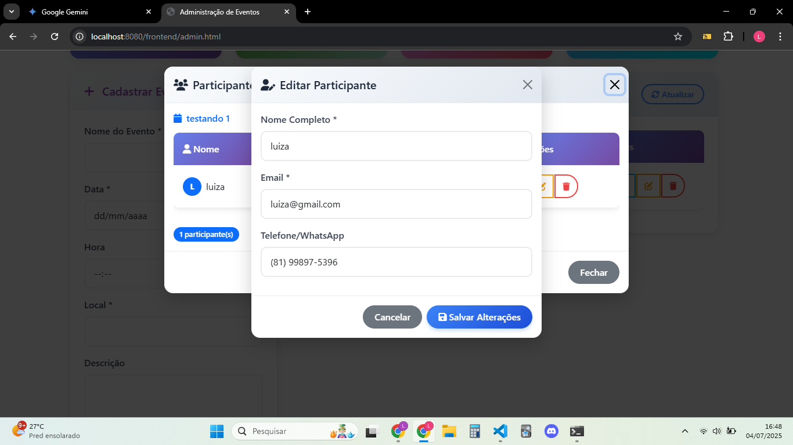

# 🎉 Sistema de Gerenciamento de Eventos

Um sistema completo e robusto para gerenciamento de eventos, desenvolvido com **backend em C++ puro** e **frontend moderno em JavaScript vanilla**. Ideal para organizadores de eventos que buscam uma solução simples, eficiente e portável.

## 📸 **Demonstração Visual**

<div align="center">
  
  <p><em>Dashboard principal com estatísticas em tempo real</em></p>
  
  
  <p><em>Painel completo de administração de eventos</em></p>
  
  
  <p><em>Interface de inscrição para participantes</em></p>
  
  
  <p><em>Visualização e gestão de participantes</em></p>
  
  
  <p><em>Modal para edição de dados de participantes</em></p>
</div>

## ✨ **Características Principais**

### 🎯 **Funcionalidades do Sistema**
- **Dashboard Intuitivo**: Estatísticas em tempo real e visão geral dos eventos
- **Gestão Completa de Eventos**: Criar, editar, excluir e visualizar eventos
- **Sistema de Inscrições**: Controle de participantes com validação de dados
- **Interface Responsiva**: Design moderno e adaptável a diferentes dispositivos
- **API RESTful**: Backend robusto com endpoints bem estruturados
- **Persistência Local**: Armazenamento em arquivo de texto para simplicidade

### 🛠️ **Tecnologias Utilizadas**

| Componente | Tecnologia | Descrição |
|------------|------------|-----------|
| **Backend** | C++ puro | Servidor HTTP com Winsock para Windows |
| **Frontend** | JavaScript ES6+ | Interface dinâmica e interativa |
| **Estilização** | Bootstrap 5 + CSS3 | Design responsivo e moderno |
| **API** | RESTful | Endpoints padronizados para comunicação |
| **Persistência** | Arquivo de texto | Simples e portável (`eventos.txt`) |

## 📁 **Estrutura do Projeto**

```
EventManagement/
├── 📂 backend/
│   ├── 📂 src/
│   │   ├── 📂 include/           # Arquivos de cabeçalho
│   │   │   ├── ApiServer.h       # Servidor HTTP
│   │   │   ├── EventManager.h    # Gerenciador de eventos
│   │   │   ├── Event.h           # Modelo de evento
│   │   │   ├── Participant.h     # Modelo de participante
│   │   │   └── Person.h          # Modelo de pessoa
│   │   ├── ApiServer.cpp         # Implementação do servidor
│   │   ├── EventManager.cpp      # Lógica de negócio
│   │   ├── Event.cpp             # Operações de eventos
│   │   ├── Participant.cpp       # Operações de participantes
│   │   ├── Person.cpp            # Operações de pessoas
│   │   └── main.cpp              # Ponto de entrada
│   └── eventos.txt               # Banco de dados local
├── 📂 frontend/
│   ├── 📂 css/
│   │   └── styles.css            # Estilos customizados
│   ├── 📂 js/
│   │   ├── 📂 components/        # Componentes reutilizáveis
│   │   ├── 📂 services/          # Serviços de API
│   │   ├── 📂 utils/             # Utilitários
│   │   ├── admin.js              # Lógica administrativa
│   │   ├── inscricoes.js         # Lógica de inscrições
│   │   └── config.js             # Configurações
│   ├── admin.html                # Painel administrativo
│   └── index.html                # Página de inscrições
├── 📂 assets/                    # Imagens e recursos
├── run_backend.bat               # Script de execução
└── README.md                     # Documentação
```

## 🚀 **Instalação e Execução**

### **Pré-requisitos**
- ✅ **Windows 10/11** (sistema operacional suportado)
- ✅ **MinGW-w64** ou **Visual Studio** com compilador C++
- ✅ **Navegador web moderno** (Chrome, Firefox, Edge)
- ✅ **Git** (opcional, para clonar o repositório)

### **Passo a Passo**

#### 1. **Compilação do Backend**
```bash
# Navegue até a pasta do projeto
cd EventManagement

# Execute o script de compilação
backend\compile_simple.bat
```

#### 2. **Execução do Servidor**
```bash
# Método 1: Duplo-clique no arquivo
run_backend.bat

# Método 2: Via terminal
.\run_backend.bat
```

#### 3. **Acesso ao Sistema**
Após a execução, você verá a mensagem: `🚀 API Server started on port 8080...`

Acesse no navegador:
- **Administração**: http://localhost:8080/frontend/admin.html
- **Inscrições**: http://localhost:8080/frontend/index.html

## 🔧 **API Endpoints**

### **Eventos**
| Método | Endpoint | Descrição |
|--------|----------|-----------|
| `GET` | `/api/eventos` | Lista todos os eventos |
| `POST` | `/api/eventos` | Cria um novo evento |
| `PUT` | `/api/eventos/{id}` | Atualiza um evento |
| `DELETE` | `/api/eventos/{id}` | Remove um evento |
| `GET` | `/api/relatorio` | Obtém relatório geral |

### **Participantes**
| Método | Endpoint | Descrição |
|--------|----------|-----------|
| `GET` | `/api/eventos/{id}/participantes` | Lista participantes de um evento |
| `POST` | `/api/eventos/{id}/participantes` | Adiciona participante ao evento |
| `PUT` | `/api/eventos/{id}/participantes/{participante_id}` | Atualiza dados do participante |
| `DELETE` | `/api/eventos/{id}/participantes/{participante_id}` | Remove participante do evento |

### **Exemplo de Uso da API**

#### Criar um Evento
```bash
curl -X POST http://localhost:8080/api/eventos \
  -H "Content-Type: application/json" \
  -d '{
    "nome": "Workshop de Programação",
    "data": "15/12/2024",
    "hora": "14:00",
    "local": "Auditório Principal",
    "descricao": "Workshop prático de C++ e JavaScript"
  }'
```

#### Listar Eventos
```bash
curl http://localhost:8080/api/eventos
```

## 🎨 **Funcionalidades Detalhadas**

### **Dashboard Administrativo**
- 📊 **Estatísticas em Tempo Real**: Total de eventos, participantes, eventos do dia
- 📅 **Calendário Visual**: Eventos organizados por data
- ⚡ **Ações Rápidas**: Criar, editar e excluir eventos com um clique
- 🔍 **Busca e Filtros**: Encontrar eventos rapidamente

### **Gestão de Eventos**
- ✅ **Validação Completa**: Verificação de dados obrigatórios
- 📝 **Formulários Intuitivos**: Interface amigável para entrada de dados
- 🗓️ **Controle de Datas**: Validação de datas e horários
- 📍 **Informações Detalhadas**: Local, descrição e capacidade

### **Sistema de Participantes**
- 👥 **Controle de Capacidade**: Limite de participantes por evento
- 📧 **Validação de Email**: Verificação de formato e duplicatas
- 📱 **Dados de Contato**: Telefone e informações pessoais
- ✏️ **Edição Flexível**: Modificar dados sem perder inscrição

### **Cenários de Teste Recomendados**
1. **Criar um evento** e verificar se aparece no dashboard
2. **Inscrever participantes** e validar o controle de capacidade
3. **Editar dados** de eventos e participantes
4. **Excluir eventos** e verificar a limpeza dos dados
5. **Testar validações** com dados inválidos

## 🔍 **Troubleshooting**

### **Problemas Comuns**

| Problema | Solução |
|----------|---------|
| **Erro de compilação** | Verifique se o MinGW está no PATH |
| **Porta 8080 ocupada** | Feche outros serviços ou altere a porta no código |
| **Arquivo não encontrado** | Execute o script de compilação primeiro |
| **Erro de conexão** | Verifique se o servidor está rodando |

### **Logs e Debug**
- O servidor exibe logs detalhados no terminal
- Verifique o arquivo `eventos.txt` para dados persistentes
- Use o console do navegador para debug do frontend


<div align="center">
  <p><strong>Desenvolvido com ❤️ para facilitar a gestão de eventos</strong></p>
  <p>⭐ Se este projeto te ajudou, considere dar uma estrela!</p>
</div>
