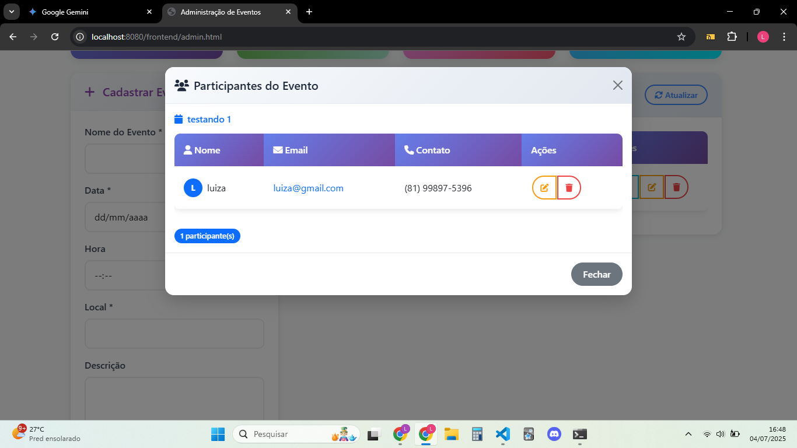

# Event Management System

Este é um sistema completo de gerenciamento de eventos, construído com um backend robusto em C++ puro e um frontend moderno e interativo em JavaScript vanilla e Bootstrap.

## 📸 **Imagens do Projeto**

As imagens a seguir ilustram algumas telas do sistema:

<p align="center">
    
    <br>
    <em>Dashboard do sistema</em>
</p>

<p align="center">
    
    <br>
    <em>Painel de administração de eventos</em>
</p>

<p align="center">
    
    <br>
    <em>Modal de inscrição para participantes</em>
</p>

<p align="center">
    
    <br>
    <em>Modal de participantes do evento</em>
</p>

<p align="center">
    
    <br>
    <em>Modal editar participantes</em>
</p>


## 🚀 **Tecnologias**

    - **Backend**: C++ puro com a biblioteca Winsock para networking no Windows.
    - **Frontend**: JavaScript (ES6+), HTML5 e CSS3 com Bootstrap 5.
    - **Arquitetura**: Servidor C++ servindo uma API RESTful e os arquivos estáticos do frontend.
    - **Persistência de Dados**: Arquivo de texto local (`eventos.txt`) para simplicidade e portabilidade.

## 📋 **Funcionalidades**

### **Dashboard**

    - 📊 Estatísticas em tempo real (total de eventos, inscritos, etc.).
    - 📅 Visualização de eventos que ocorrem hoje e os próximos.

### **Gerenciamento de Eventos**

    - ➕ Criar novos eventos com validação de dados.
    - ✏️ Editar informações de eventos existentes.
    - 🗑️ Excluir eventos.
    - 👁️ Visualizar detalhes completos de um evento.

### **Gerenciamento de Participantes**

    - 📝 Inscrever participantes em eventos específicos.
    - ✏️ Editar dados de participantes inscritos.
    - 🗑️ Remover participantes de um evento.
    - 📋 Listar todos os participantes de um evento com controle de capacidade.

## 📁 **Estrutura do Projeto**

```
EventManagement/
├── backend/
│   ├── build/                # Arquivos de compilação (executável e objetos)
│   │   └── backend.exe
│   ├── src/                  # Código-fonte do backend
│   │   ├── include/          # Arquivos de cabeçalho (.h)
│   │   │   ├── ApiServer.h
│   │   │   ├── EventManager.h
│   │   │   ├── Event.h
│   │   │   ├── Participant.h
│   │   │   └── Person.h
│   │   ├── ApiServer.cpp
│   │   ├── EventManager.cpp
│   │   ├── Event.cpp
│   │   ├── Participant.cpp
│   │   ├── Person.cpp
│   │   └── main.cpp          # Ponto de entrada do programa
│   └── eventos.txt           # Arquivo de persistência dos dados
├── frontend/
│   ├── admin.html            # Painel de administração de eventos
│   ├── index.html            # Página de inscrição para participantes
│   ├── css/
│   │   └── styles.css
│   └── js/
│       ├── components/
│       ├── services/
│       │   └── apiService.js
│       ├── utils/
│       └── admin.js          # Lógica do painel de administração
├── assets/
│   ├── dashboard.png
│   ├── admin_eventos.png
│   └── inscricao_participante.png
└── README.md                 # Este arquivo
```

## ⚙️ **Como Executar e Testar**

Siga os passos abaixo para compilar e executar o projeto em um ambiente Windows.

### **Pré-requisitos**

    - Um compilador C++, como o **MinGW (g++)**, instalado e configurado no `PATH` do sistema.
    - Um navegador web moderno (Chrome, Firefox, Edge).
    - (Opcional) **Visual Studio Code** com a extensão **Thunder Client** para testar a API.

### **1. Compilando o Backend**

Para criar o executável do servidor, você pode usar o script de compilação fornecido.

1.  Abra um terminal (CMD ou PowerShell).

2.  Navegue até a pasta raiz do projeto `EventManagement/`.

3.  Execute o script de compilação:

        ```bash
        backend\compile_simple.bat
        ```

        Isso executará o comando `g++` com todos os parâmetros necessários e criará o arquivo `backend.exe` dentro da pasta `backend/build/`.

### **2. Executando o Servidor (Backend)**

Com o backend compilado, para iniciar o servidor, basta usar o script principal.

    * **Método Simples:**

        1.  No Windows Explorer, navegue até a pasta raiz do seu projeto.
        2.  Encontre o arquivo **`run_backend.bat`** e dê um **duplo-clique** nele.

    * **Método via Terminal:**

        1.  Abra um terminal na pasta raiz do projeto.
        2.  Digite e execute:
                ```bash
                run_backend.bat
                ```

Em ambos os casos, uma nova janela de terminal será aberta e, se tudo ocorrer bem, você verá a mensagem: `🚀 API Server started on port 8080...`. O servidor agora está rodando. **Não feche esta janela do terminal.**

### **3. Acessando a Interface (Frontend)**

Com o servidor rodando, abra seu navegador e acesse as páginas:

    - **Painel de Administração:** `http://localhost:8080/frontend/admin.html`
    - **Página de Inscrição:** `http://localhost:8080/frontend/index.html`

### **4. Testando as Rotas da API (com Thunder Client)**

Você pode usar o **Thunder Client** no VS Code para interagir diretamente com a API e verificar seu funcionamento.

| Funcionalidade | Método | URL | Corpo (JSON) de Exemplo |
| :--- | :--- | :--- | :--- |
| **Listar Eventos** | `GET` | `http://localhost:8080/api/eventos` | *(Nenhum)* |
| **Obter Relatório**| `GET` | `http://localhost:8080/api/relatorio` | *(Nenhum)* |
| **Criar Evento** | `POST`| `http://localhost:8080/api/eventos` | `{"nome":"Evento de Teste","data":"DD/MM/AAAA","hora":"HH:MM","local":"Online","descricao":"Descrição do evento"}` |
| **Listar Participantes** |`GET` | `http://localhost:8080/api/eventos/1/participantes`| *(Nenhum)* |
| **Editar Participante**|`PUT` | `http://localhost:8080/api/eventos/1/participantes/1`| `{"nome":"Novo Nome","email":"novo@email.com","contato":"(81) 99999-8888"}` |
| **Deletar Evento** |`DELETE`|`http://localhost:8080/api/eventos/1` | *(Nenhum)* |