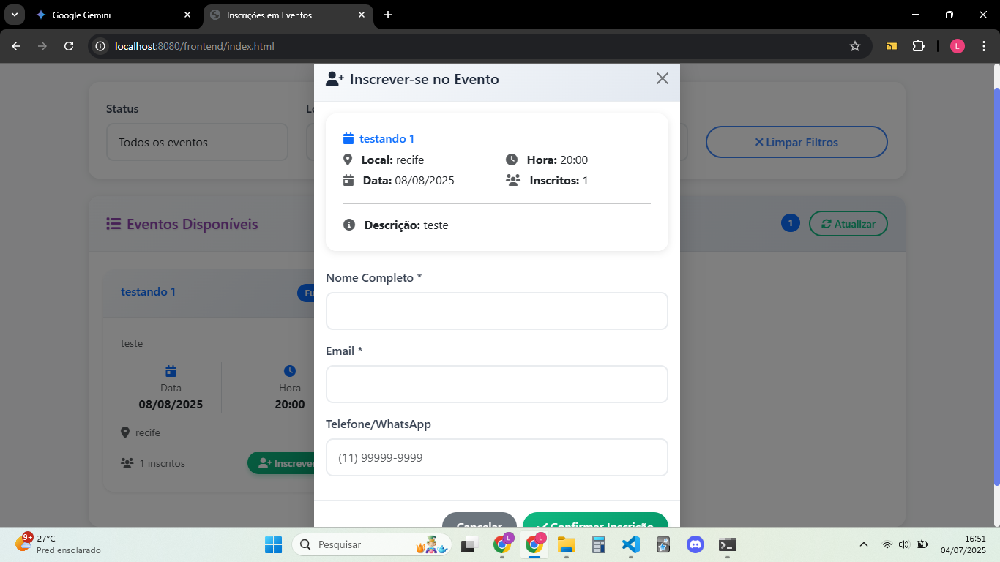

<div style="text-align: center;">
  <h1>Event Management System</h1>
  <p class="lead">
    Um sistema completo de gerenciamento de eventos, com um backend robusto em C++ puro e um frontend moderno e interativo em JavaScript vanilla e Bootstrap.
  </p>
</div>

<p align="center">
  <a href="#-vídeo-de-apresentação"><strong>▶️ Vídeo</strong></a> ·
  <a href="#-funcionalidades"><strong>📋 Funcionalidades</strong></a> ·
  <a href="https://github.com/SEU-USUARIO/SEU-REPOSITORIO"><strong>📦 Código Fonte ↗</strong></a> ·
  <a href="./assets/relatorio.pdf"><strong>📄 Relatório (PDF) ↗</strong></a>
</p>

---

### 🎥 **Vídeo de Apresentação**

Assista ao vídeo abaixo para uma demonstração completa do sistema, explicando a arquitetura, funcionalidades e o código-fonte.

<div align="center">
  <iframe width="800" height="450" src="https://www.youtube.com/embed/COLOQUE_O_ID_DO_SEU_VIDEO_AQUI" title="YouTube video player" frameborder="0" allow="accelerometer; autoplay; clipboard-write; encrypted-media; gyroscope; picture-in-picture; web-share" allowfullscreen></iframe>
</div>

---

### 📸 **Galeria de Imagens**

<table align="center">
  <tr>
    <td align="center">
      
      <br>
      <em>Dashboard com estatísticas em tempo real.</em>
    </td>
    <td align="center">
      
      <br>
      <em>Painel de administração de eventos.</em>
    </td>
  </tr>
  <tr>
    <td align="center">
      
      <br>
      <em>Visualização de participantes de um evento.</em>
    </td>
    <td align="center">
      
      <br>
      <em>Modal de inscrição para novos participantes.</em>
    </td>
  </tr>
</table>

---

### 🚀 **Tecnologias**

-   **Backend**: C++ puro com a biblioteca Winsock para networking no Windows.
-   **Frontend**: JavaScript (ES6+), HTML5 e CSS3 com Bootstrap 5.
-   **Arquitetura**: Servidor C++ servindo uma API RESTful e os arquivos estáticos do frontend.
-   **Persistência de Dados**: Arquivo de texto local (`eventos.txt`) para simplicidade e portabilidade.

### 📋 **Funcionalidades**

#### **Dashboard**
-   📊 Estatísticas em tempo real (total de eventos, inscritos, etc.).
-   📅 Visualização de eventos que ocorrem hoje e os próximos.

#### **Gerenciamento de Eventos**
-   ➕ Criar novos eventos com validação de dados.
-   ✏️ Editar informações de eventos existentes.
-   🗑️ Excluir eventos.
-   👁️ Visualizar detalhes completos de um evento.

#### **Gerenciamento de Participantes**
-   📝 Inscrever participantes em eventos específicos.
-   ✏️ Editar dados de participantes inscritos.
-   🗑️ Remover participantes de um evento.
-   📋 Listar todos os participantes de um evento com controle de capacidade.

---

### ℹ️ **Informações Técnicas**

<details>
  <summary><strong>⚙️ Como Executar e Testar o Projeto</strong></summary>

  Siga os passos abaixo para compilar e executar o projeto em um ambiente Windows.

  #### **Pré-requisitos**
  - Um compilador C++, como o **MinGW (g++)**, instalado e configurado no `PATH` do sistema.
  - Um navegador web moderno (Chrome, Firefox, Edge).
  - (Opcional) **Visual Studio Code** com a extensão **Thunder Client** para testar a API.

  #### **1. Compilando o Backend**
  Para criar o executável do servidor, você pode usar o script de compilação fornecido.
  1.  Abra um terminal (CMD ou PowerShell).
  2.  Navegue até a pasta raiz do projeto `EventManagement/`.
  3.  Execute o script de compilação:
      ```bash
      backend\compile_simple.bat
      ```
      Isso executará o comando `g++` com todos os parâmetros necessários e criará o arquivo `backend.exe` dentro da pasta `backend/build/`.

  #### **2. Executando o Servidor (Backend)**
  Com o backend compilado, para iniciar o servidor, basta usar o script principal.
  - **Método Simples:**
    1.  No Windows Explorer, navegue até a pasta raiz do seu projeto.
    2.  Encontre o arquivo **`run_backend.bat`** e dê um **duplo-clique** nele.
  - **Método via Terminal:**
    1.  Abra um terminal na pasta raiz do projeto.
    2.  Digite e execute: `run_backend.bat`

  Uma nova janela de terminal será aberta com a mensagem: `🚀 API Server started on port 8080...`. **Não feche esta janela.**

  #### **3. Acessando a Interface (Frontend)**
  Com o servidor rodando, abra seu navegador e acesse:
  -   **Painel de Administração:** `http://localhost:8080/frontend/admin.html`
  -   **Página de Inscrição:** `http://localhost:8080/frontend/index.html`
</details>

<details>
  <summary><strong>🗺️ Rotas da API (Endpoints para Teste)</strong></summary>

  | Funcionalidade | Método | URL | Corpo (JSON) de Exemplo |
  | :--- | :--- | :--- | :--- |
  | **Listar Eventos** | `GET` | `http://localhost:8080/api/eventos` | *(Nenhum)* |
  | **Obter Relatório**| `GET` | `http://localhost:8080/api/relatorio` | *(Nenhum)* |
  | **Criar Evento** | `POST`| `http://localhost:8080/api/eventos` | `{"nome":"Evento de Teste","data":"DD/MM/AAAA","hora":"HH:MM","local":"Online","descricao":"Descrição do evento"}` |
  | **Listar Participantes** |`GET` | `http://localhost:8080/api/eventos/1/participantes`| *(Nenhum)* |
  | **Editar Participante**|`PUT` | `http://localhost:8080/api/eventos/1/participantes/1`| `{"nome":"Novo Nome","email":"novo@email.com","contato":"(81) 99999-8888"}` |
  | **Deletar Evento** |`DELETE`|`http://localhost:8080/api/eventos/1` | *(Nenhum)* |
</details>

<details>
  <summary><strong>📁 Estrutura do Projeto</strong></summary>